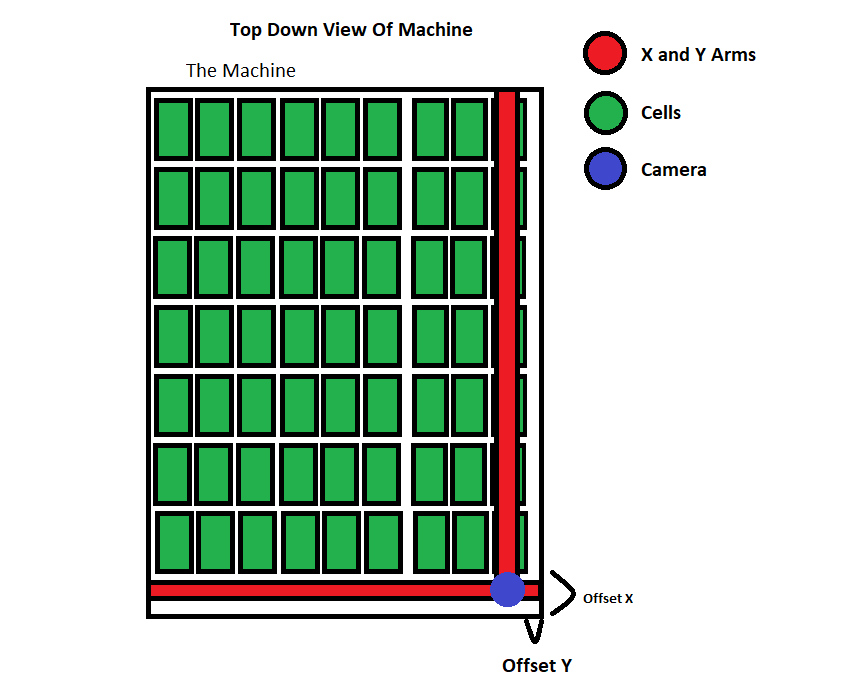

# Mega-Worm-Data-Collector
The Machine in the Lab that collects ALL THE DATA
# How to Use
run `bash req.bash` to download dependencies

To start: `python3 main.py`

# Description of the Data Collection Machine

This software was created to run a big machine that can move a camera around, and record a certain "cell".
Each cell is essentially a 2 dimensional section, and the machine is built around a BUNCH of these cells. The cells are rectangular and laid out in a grid pattern.
Essentially the machine has a raspberry pi or other UNIX computer hooked up to it, which acts as the controller. The actual software of this controller is this project.

# My thoughts when designing this software (and first impressions on its predecessor)
  I inherited code to this project that was... quite overdone. While It had a GUI, the version I inherited was broken anyway, and the project was made up of something like 20-40 different non-dependency files written in C/C++ (or a similar lower level language). Obviously this isn't a BIG deal when you have a BIG project, but for this, I thought I could do better. It also had not been worked in a while, and the author graduated university and wasn't maintaining it anymore.  The professor also specified he would like to get this machine in the hands of non-programmers (mainly biologists), so them modifying the code in any sort of way was out of the question with the old software architecture. Taking this into account, I made a business decision to go ahead and see if I could rewrite this in both a friendlier language, and in a friendlier way. Another goal was to make this code as flexible, nonspaghettied as possible and easy to scale (cell wise).

# Problems and my interpretations and solutions

## Easier Language Problem
  Python 3. Lots of academics that I knew already had some sort of grasp with it anyway, and it would be easy to lookup and understand if you came from outside of CS. I was also using Python 3 in a course I was taking, so I figured making an actual project would demonstrate both my proficiency and pad my resume.

## The Spaghetti and Flexible Problem
  These two are mutually tied together. My idea was that if I could write some general code, someone could then code some glue for their specific purpose, or could use my flexible glue as long as the machines were pretty similar. Essentially, split up logic into specific files based on their domain - basic Code Complete 2nd Edition type stuff. 
  In fact, while the motor movement controls wouldn't really be used for anything other than very similar projects, my abstraction of OpenCV2 for python is a pretty general tool that can be used by any program. Though, OpenCV2 is kinda weird with webcams and cameras, and you need to play with the settings to get things to work.
  The movement controls are actually pretty useful, if you were to have this machine, but modified it, say you only had a row of cells, thats easily done. If you had more cells, or a larger grid, the software will figure out how many clicks on a stepper motor is equal to one cell as long as it knows the offset and the number of cells in a row. Really just input any numbers for row or columns and it should theoretically work. All methods within the `Control` class may use each other, but everything is built on top of something that is still useful. 
  Both of these tools don't need to be used together, and are not dependent on each other.

# Me using my libraries to make main.py
  My implementation outside of my libraries is about 31 lines including import statements. The main method is defined with 21 lines of code, some of which are print statements in lieu of a GUI (for now). A GUI could easily be built on top of this, especially since all camera and movement logic is abstracted out to a very simple set of flexible, inter-connectable  tools available for even the most basic of scripters in the biology lab.
It reads like English.
